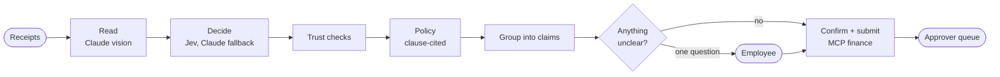

# ClaimPilot

**From a pile of receipts to "ready to submit" in about 30 seconds: an AI-native expense and reimbursement agent.**
Built for **AI Innovation Lab, Season 2** (Business Case 1: Expense & Reimbursement Agent). All data is synthetic and the finance system is mocked.

[](https://github.com/Shubham-Kanade/claimpilot/actions/workflows/ci.yml)

| | |
|---|---|
| **Demo video** | _YouTube link: added at submission_ |
| **Live demo** | _Hugging Face Space link: added at submission_ (no login; pick a demo persona) |
| **Technical design document** | [docs/TECHNICAL_DESIGN.md](docs/TECHNICAL_DESIGN.md) (architecture and flow diagrams, AI design, setup, code walkthrough, assumptions) |
| **Decisions** | [docs/DECISIONS.md](docs/DECISIONS.md) (32 short ADRs with the evidence behind each choice) |

## What it does

Drop in photos, PDFs or UPI screenshots. ClaimPilot then:

1. **reads** every receipt with Claude vision (structured outputs, Hindi and handwritten bills included);
2. makes fast typed decisions per receipt (category, alcohol, personal expense) with **Jev**, a "System One" decision model, and falls back to Claude when it is unsure or unavailable;
3. **checks trust**: exact and near duplicates, edited totals, GSTIN and GST arithmetic, file forensics, AI-generated content credentials, and **prompt-injection text hidden in a receipt**;
4. applies a **clause-cited expense policy** (every finding quotes the clause behind it);
5. **groups** the pile into trips, monthly claims and events;
6. asks **one** combined question, and only for what it cannot infer (the calendar answers some of them);
7. submits to a mocked finance system over **MCP** after your explicit confirmation, and shows approvers a risk-ranked queue.



## Measured, not claimed

| What | Result | Where |
|---|---|---|
| Field extraction on a held-out set of 80 receipts (Claude Haiku 5.5 with a second opinion) | critical fields 99.0%, all fields 95.4% | [evals/reports](evals/reports) |
| Genuine receipts wrongly accused because a figure was misread | 8 of 80 with one read, **1 of 80** with the second opinion | [ADR-031](docs/DECISIONS.md) |
| Cost of reading a receipt | about **$0.0005** for the first read, $0.0025 on average with the second opinion and click-to-verify; p50 2.1 s | [ADR-018](docs/DECISIONS.md), [ADR-031](docs/DECISIONS.md) |
| Model choice | a cascade to Sonnet on every unsure field costs 10x for +1.9 points, so Haiku reads and Sonnet only re-reads what looks wrong | bake-off, ADR-018, ADR-031 |
| System One vs LLM on category (80 held-out documents) | same accuracy (85%), Jev about **3× faster and cheaper** | ADR-021 |
| Duplicates, injection, tampered totals | 4/4, 4/4, 4/4 caught; 0 false positives on 88 clean documents | ADR-026 |
| Policy rules on the golden set | 0 of 80 legitimate receipts flagged, 4 of 4 over-policy cases caught | ADR-024 |
| Claim grouping against ground-truth trips | F1 = 1.000 | ADR-025 |
| Tests | **1,737 API tests at 98.7% coverage**, plus MCP servers (100%), synthetic-data generator and web (see below) | CI |

## Run it

**Hosted demo:** open the live-demo link above. Choose *Asha Menon*, press **Try with sample receipts**, answer the one question, confirm, then switch to *Ravi Iyer* to approve. The samples are read from recorded model answers, so the hosted demo costs nothing to run.

**Everything on your machine (Docker):**
```bash
cp .env.example .env                                   # LLM_MODE=replay works with no API key
docker compose -f infra/compose.yml up --build         # web :3000 · api :8000 · worker · postgres · redis · 2 MCP servers
uv run --project services/api python scripts/smoke.py  # drives a pile of receipts all the way to an approved claim
```

**Read your own receipts:** set `ANTHROPIC_API_KEY` and `LLM_MODE=live` in `.env`. Optionally add `JEV_API_KEY` and `DECISION_ENGINE=jev` for System One. Model choice per task is configuration: `ROUTE_EXTRACTION=sonnet`.

**Development without Docker:**
```bash
cd services/api && uv sync && uv run uvicorn claimpilot.main:app --reload
cd apps/web && npm install && npm run dev
```

## Tests
```bash
cd services/api && uv run pytest --cov     # unit, API, pipeline, replay; never calls a paid API by default
cd services/mcp-finance && uv run pytest   # likewise services/mcp-corp and data/synth
cd apps/web && npm run test:coverage       # Vitest + React Testing Library + MSW
cd apps/web && npm run e2e                 # Playwright + axe against a mock API
```
The layers (unit, LLM record/replay, request-shape snapshots for every model, pipeline end to end, API, contract drift, evals) are described in [docs/TECHNICAL_DESIGN.md](docs/TECHNICAL_DESIGN.md#7-testing-strategy--results).

## Repository

| Path | What |
|---|---|
| `services/api` | FastAPI backend and worker: extraction, decisions, trust, policy, claims, pipeline, MCP clients, evals |
| `services/mcp-finance`, `services/mcp-corp` | the mocked finance system and corporate systems (HR directory, calendar, policy) as MCP servers |
| `services/mcp-claimpilot` | ClaimPilot itself as an MCP server: file, answer, submit and approve claims from Claude Desktop ([README](services/mcp-claimpilot/README.md)) |
| `apps/web` | Next.js web app (upload, live progress, claim review, approvals, impact) |
| `data/synth` | the synthetic Indian receipt generator, the golden set and the demo pile |
| `deploy/hf-space` | the single-container hosted demo |
| `infra`, `.github/workflows` | Docker Compose, CI and CD |
| `docs` | design document, decision log, task tracker |
| `.claude` | rules, skills and agents used to build it (a new session can resume from them) |

## Data and compliance
Everything here is synthetic: the receipts, people, merchants, GSTINs and the company policy are fictional, and nothing is real company data. No secrets are committed (`.env` is ignored; gitleaks runs in CI).
