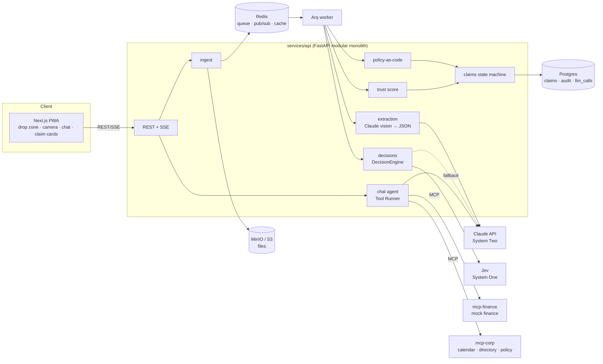

# Architecture

## Module boundaries (services/api/src/claimpilot)
| Module | Owns | Must not |
|---|---|---|
| `ingest` | upload validation, storage, job enqueue | call LLMs |
| `extraction` | image/PDF → `ExtractedReceipt` via the LLM layer, OCR boxes | make policy decisions |
| `decisions` | `DecisionEngine` protocol and the Jev/LLM adapters | know about HTTP |
| `policy` | rules compiled from the policy doc, evaluation with clause citations | call LLMs at evaluation time |
| `trust` | duplicates (pHash + fingerprint), arithmetic/GST checks, EXIF, C2PA, injection signals | mutate claims |
| `claims` | grouping, claim state machine (complete / missing / questionable), submission | parse documents |
| `chat` | conversational agent, tool bridge to MCP, approval gate | bypass `claims` for submission |
| `llm` | model registry, capability shim, cost ledger, replay mode | be imported by `policy` |

## Key flows
1. **Upload → claim:**
   1. `POST /v1/uploads` stores the files and enqueues a job.
   2. The worker extracts (with cache), decides (Jev/LLM), runs trust and policy, then groups.
   3. SSE events stream progress.
   4. The claim lands as `draft` with open questions.
2. **Clarify → submit:**
   1. The chat agent asks one combined question.
   2. The user answers and the claim moves to `ready`.
   3. The user confirms.
   4. `submit_claim` goes through the approval gate to `mcp-finance`.

## Cross-cutting
- **Config:** 12-factor env vars (`.env.example`). The model registry lives in `services/api/config/models.yaml`.
- **Observability:** OpenTelemetry (GenAI semantic conventions) → Langfuse. JSON logs.
- **Health:** `/healthz` (liveness) and `/readyz` (dependencies) on every service.
