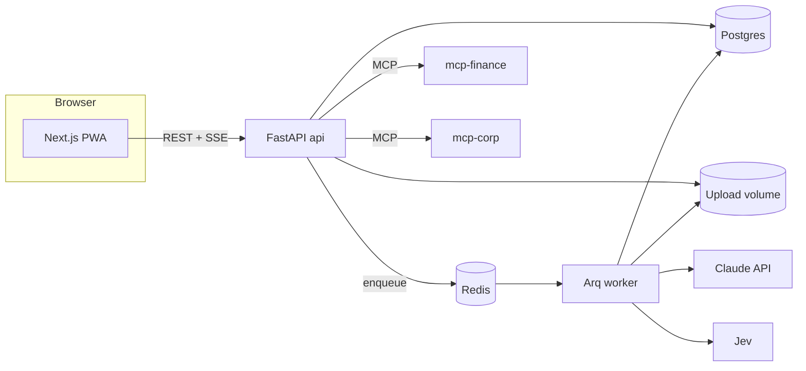
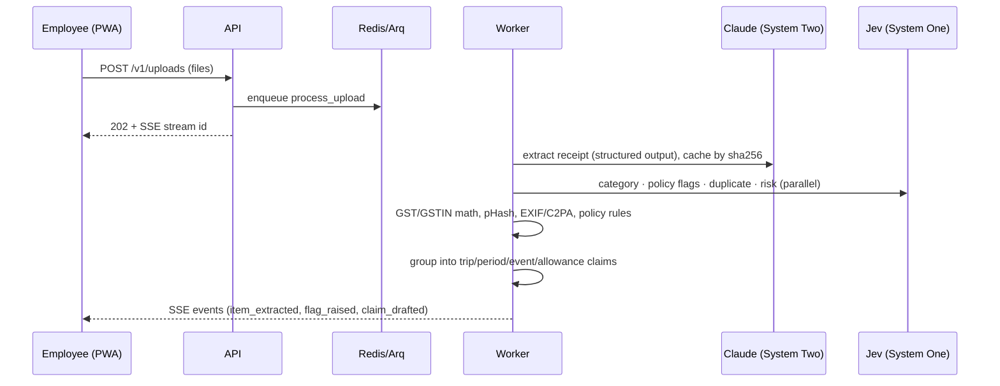
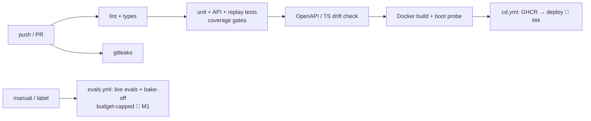

# ClaimPilot: Technical Design Document

> **Status:** living document, updated at the end of every milestone. Sections marked 🚧 are filled in as the corresponding milestone lands.
> **Demo video:** _YouTube link added at M5_ · **Hosted app:** _URL added at M4_ · **Repo:** _GitHub URL_

## 1. Project overview

### 1.1 Track selected
**Business Case 1: Expense & Reimbursement Agent.** We build the **complete experience**: the user-facing product *and* the backend intelligence. The corporate finance, HR and calendar systems are mocked, as the brief allows.

### 1.2 Problem
Employees spend real time on reimbursement:
- collecting bills
- typing in details
- choosing categories
- checking what the policy allows
- assembling claims

Finance teams then spend more time catching errors, duplicates and policy breaches. Receipts are messy: thermal-paper photos, PDFs, UPI screenshots, handwritten and Hindi bills.

### 1.3 Solution in one line
**From a pile of receipts to "ready to submit" in about 30 seconds.** ClaimPilot does the reimbursement work itself and asks the employee only what it can't infer.

### 1.4 Users
| User | Goal |
|---|---|
| Employee | Drop receipts (desktop or phone camera) and get a correct, complete, policy-compliant claim with minimal effort |
| Approver / finance | Review a risk-ranked queue with evidence (flags, policy clauses, trust signals) and approve low-risk claims quickly |

### 1.5 Success metrics
| Metric | Target | Measured by |
|---|---|---|
| Critical-field extraction accuracy (amount, date, GSTIN, merchant) | ≥ 95% | eval harness on the synthetic golden set |
| Category accuracy | ≥ 90% | eval harness |
| Duplicate / tampered / injection receipts caught | ≥ 95% / ≥ 90% / 100% not auto-approved | adversarial eval set |
| Questions asked per claim | ≤ 1 combined question | agent trajectory tests |
| Cost per receipt | lowest model config on the Pareto frontier that passes the gates | model bake-off + cost ledger |
| Time from upload to draft claim (15 receipts) | ≤ 60 s | E2E timing |

## 2. System architecture

### 2.1 System context


### 2.2 Containers

For the rationale (modular monolith, no Kubernetes, Redis uses), see [DECISIONS.md](DECISIONS.md) ADR-003, ADR-004 and ADR-009.

### 2.3 Upload → draft claim (sequence) 🚧 M1–M2


### 2.4 Clarify → submit (sequence) 🚧 M3
_The chat agent asks one combined question. The approval gate means `submit_claim` is called only after an explicit confirm, through MCP._

### 2.5 Claim state machine 🚧 M2
_draft → needs_info → ready → submitted → approved/rejected, with guards._

### 2.6 System One / System Two decision flow 🚧 M2
_Confidence-based routing: auto, ask the user, or escalate to the LLM or a human._

### 2.7 CI/CD pipeline


## 3. AI design 🚧 M1–M2
- **3.1 Extraction:** prompt, schema, structured outputs, image downscaling, OCR word boxes for click-to-verify.
- **3.2 System One decisions:** the Jev questions (Choice/Score/Noul) and their LLM-adapter twins.
- **3.3 Model registry and capability shim:** see [models.yaml](../services/api/config/models.yaml).
- **3.4 Model bake-off results:** Pareto chart, chosen routes, cost per 1,000 receipts.
- **3.5 Prompt caching and the cost ledger.**
- **3.6 Prompt-injection and trust defences.**

## 4. Data 🚧 M1
Synthetic Indian receipts are generated *from ground truth first, then rendered*, so labels are exact. The pipeline is Faker `en_IN`, valid-checksum GSTINs, HTML templates rendered by Playwright, and Augraphy degradation, plus an adversarial set. No real data is used anywhere.

## 5. Setup & deployment

### 5.1 Prerequisites
Docker (with Compose v2), or for local development: Python 3.13 via `uv`, and Node 22.

### 5.2 Run everything locally
```bash
git clone <repo> && cd claimpilot
cp .env.example .env          # LLM_MODE=replay works with no API key
docker compose -f infra/compose.yml up --build
# web http://localhost:3000 · api http://localhost:8000/docs
```

### 5.3 Development
```bash
cd services/api && uv sync && uv run uvicorn claimpilot.main:app --reload
cd apps/web && npm install && npm run dev
```

### 5.4 Live LLM mode
Set `ANTHROPIC_API_KEY` and `LLM_MODE=live` in `.env`. Choose models per route with `ROUTE_<NAME>=haiku|sonnet|opus`.

### 5.5 Hosted deployment 🚧 M4

## 6. Code walkthrough
| Path | Responsibility |
|---|---|
| `services/api/src/claimpilot/main.py` | FastAPI app factory; mounts the routers |
| `.../health.py` | `/healthz` (liveness) and `/readyz` (Postgres + Redis checks, injectable for tests) |
| `.../meta.py` | `/v1/meta`: the resolved model per route and the LLM mode, shown in the UI |
| `.../llm/registry.py` | Model registry: per-model capabilities and prices, route resolution with env overrides, cost estimation |
| `.../worker.py` | Arq worker entrypoint (pipeline jobs from M1) |
| `apps/web/src/lib/api/` | Typed API client; `schema.d.ts` is generated from OpenAPI |
| 🚧 | `extraction`, `decisions`, `policy`, `trust`, `claims`, `chat` modules land in M1–M3 |

## 7. Testing strategy & results
The layers are listed in [.claude/rules/testing.md](../.claude/rules/testing.md): unit, LLM replay, contract, model switching, agent trajectory, API, frontend unit, E2E, and evals.

| Suite | Tests | Coverage | Gate |
|---|---|---|---|
| API (pytest) | 16 | 92.9% (M0) | ≥ 85% overall, ≥ 90% on core modules |
| Web (Vitest) | 9 | 100% lines (M0) | ≥ 80% lines |
| E2E (Playwright) | 🚧 M3 | n/a | must pass in CI |
| Evals | 🚧 M1 | n/a | thresholds in `run-evals` skill |

## 8. Assumptions & limitations
- The finance, HR directory, calendar and policy systems are **mocked** (MCP servers with seed data). Integration points are real protocols, so swapping in real systems needs no change to agent logic.
- All receipts are **synthetic or public-dataset**, and brands are fictional. Results on real-world receipts may differ.
- **Jev** is in early access. When it's unavailable, an LLM adapter with the same typed interface takes over, and parity is tested.
- Demo personas replace real SSO in the hosted demo so judges need no access request.
- Currency: INR first. Multi-currency is a later extension.

## 9. Future work 🚧 M5
