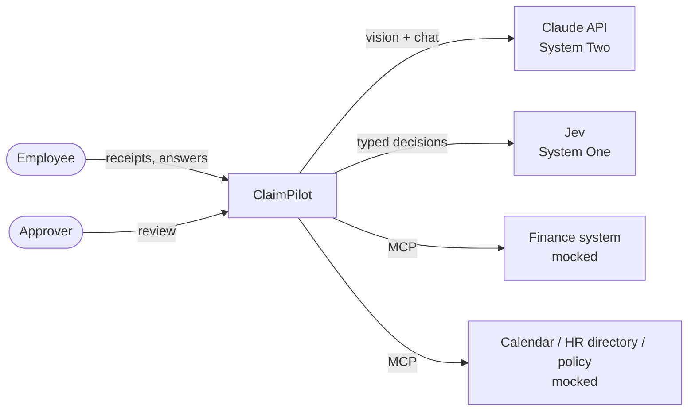
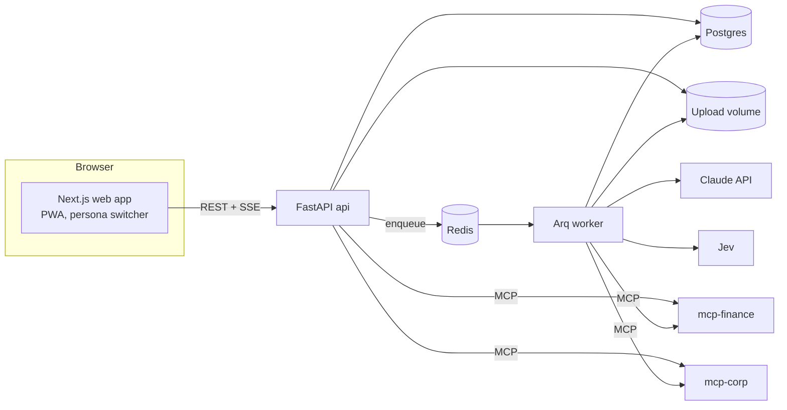
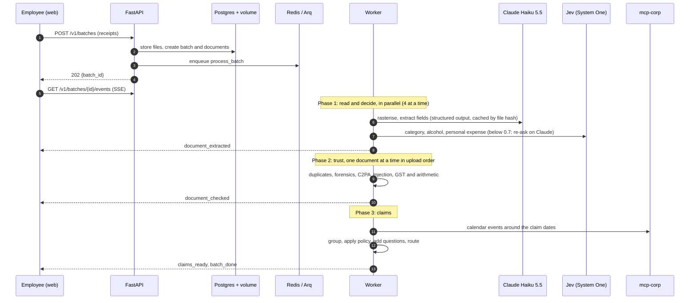
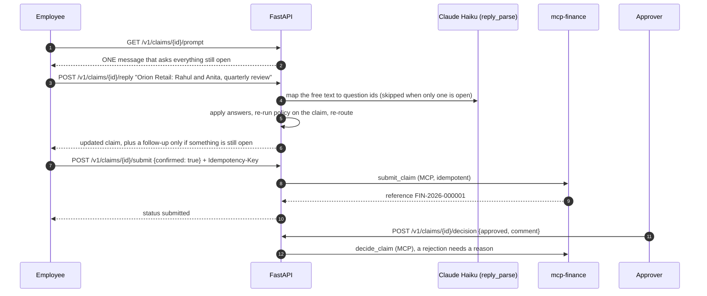
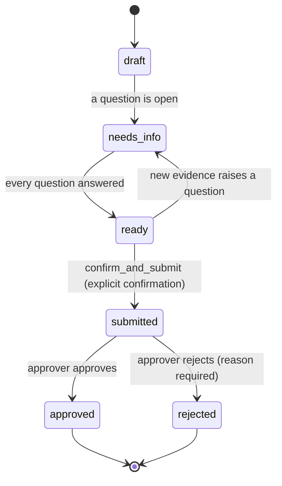
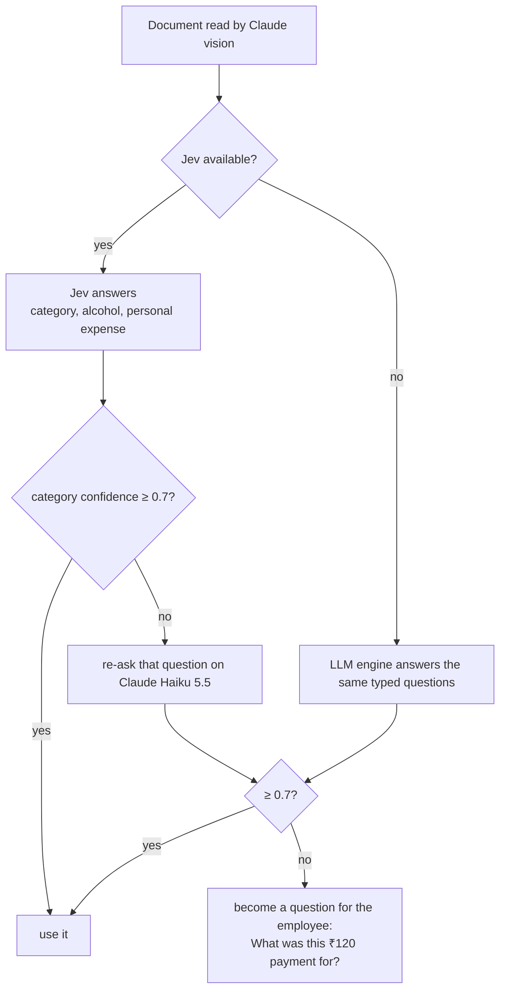
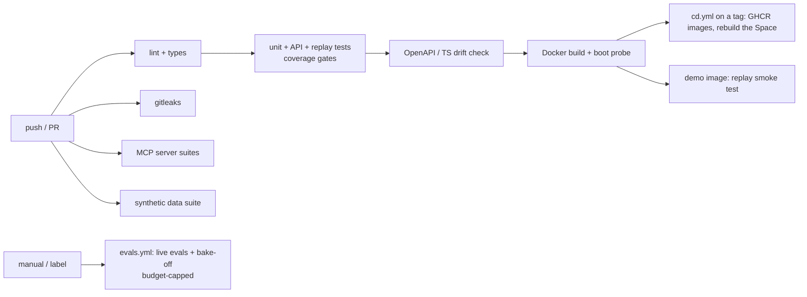
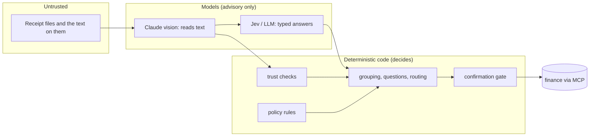
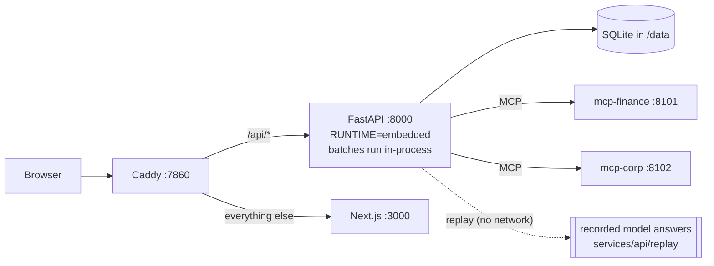

# ClaimPilot: Technical Design Document

> **Status:** living document, updated at the end of every milestone. Sections marked 🚧 are still being filled in.
> **Demo video:** _YouTube link added at M5_ · **Hosted app:** _URL added at M4_ · **Repo:** https://github.com/Shubham-Kanade/claimpilot
> **Reading guide:** §1 overview and track · §2 architecture and flow diagrams · §3 how the AI works · §5 setup and deployment · §6 code explanations · §8 assumptions. The decision log with the evidence behind each choice is [DECISIONS.md](DECISIONS.md).

## 1. Project overview

### 1.1 Track selected
**Business Case 1: Expense & Reimbursement Agent.** We build the **complete experience**: the user-facing product *and* the backend intelligence. The corporate finance, HR and calendar systems are mocked, as the brief allows.

### 1.2 Problem
Employees spend real time on reimbursement:
- collecting bills
- typing in details
- choosing categories
- checking what the policy allows
- assembling claims

Finance teams then spend more time catching errors, duplicates and policy breaches. Receipts are messy: thermal-paper photos, PDFs, UPI screenshots, handwritten and Hindi bills.

### 1.3 Solution in one line
**From a pile of receipts to "ready to submit" in about 30 seconds.** ClaimPilot does the reimbursement work itself and asks the employee only what it can't infer.

What the employee sees:
1. Drop a pile of receipts (photos, PDFs, screenshots) on the page, or take pictures with the phone camera.
2. Watch every receipt being read, categorised and checked, live.
3. Get the receipts grouped into claims (a business trip, a month of local travel, a client dinner) with the policy clause behind every flag.
4. Answer **one** combined question in plain words ("Who attended the dinner, and why?"), only if one is really needed.
5. Confirm, and the claim goes to the finance system. Nothing is submitted without that explicit confirmation.

What the approver sees: a queue ranked by risk, each claim with its evidence (flags, the policy clause, trust signals, the original receipt with the extracted fields highlighted), and a small, clean claim is marked auto-approvable so the approver can clear it in one click. Nothing is approved without that click: `auto_approve` is a label that says no one needs to look closely, not a skip.

### 1.4 Users
| User | Goal |
|---|---|
| Employee | Drop receipts (desktop or phone camera) and get a correct, complete, policy-compliant claim with minimal effort |
| Approver / finance | Review a risk-ranked queue with evidence (flags, policy clauses, trust signals) and approve low-risk claims quickly |

### 1.5 What makes it more than a demo
| Idea | Where it lives |
|---|---|
| **System One / System Two hybrid.** Claude reads and converses; Jev (a fast typed decision model) classifies. Below a confidence gate the answer becomes a question for the employee, never a silent guess | §2.6, §3.3 |
| **India-native checks:** GSTIN checksum, CGST/SGST/IGST arithmetic against GST 2.0 slabs, UPI proof, Hindi and handwritten bills | §3.7 |
| **Trust score:** duplicates (exact file, same picture, same bill photographed twice), tampered totals, metadata forensics, C2PA "made by AI" declarations, **prompt-injection text on a receipt** | §3.7 |
| **Policy as code with citations:** the policy is a YAML file of numbered clauses; every finding quotes the clause that caused it | §3.8 |
| **Ask once, ask only what is needed:** all open questions are merged into a single message; calendar data answers some before they are asked | §3.9 |
| **Deterministic where money moves:** routing, policy verdicts and the confirmation gate never read model prose (ADR-022) | §2.8 |
| **Cost-aware model choice:** a bake-off picked Claude Haiku 5.5 at $0.42 per 1,000 receipts; every route can be switched to Sonnet or Opus by configuration | §3.4, §3.5 |
| **MCP:** the finance system, HR directory, calendar and policy are real MCP servers behind typed clients | §3.10 |

### 1.6 Success metrics
| Metric | Target | Measured by |
|---|---|---|
| Critical-field extraction accuracy (amount, date, GSTIN, merchant) | ≥ 95% | eval harness on the synthetic golden set (§3.5: 100% on the dev split) |
| Category accuracy | ≥ 90% | eval harness (§3.3: 85% held-out, with the remainder turned into questions) |
| Duplicate / tampered / injection receipts caught | ≥ 95% / ≥ 90% / 100% not auto-approved | adversarial eval set (§3.7) |
| Questions asked per claim | ≤ 1 combined question | claim and pipeline tests (§7) |
| Cost per receipt | lowest model config on the Pareto frontier that passes the gates | model bake-off + cost ledger (§3.5) |
| Time from upload to draft claim (15 receipts) | ≤ 60 s | E2E timing 🚧 |

## 2. System architecture

### 2.1 System context


### 2.2 Containers

| Container | Role | Why it is separate |
|---|---|---|
| `web` | Next.js 16 app: upload, live progress, claim review, approvals | the browser's code; talks only to `api` |
| `api` | FastAPI: REST + SSE, validation, persona, claim actions (answer / submit / decide) | stateless, scales horizontally |
| `worker` | Arq job `process_batch`: reading, decisions, trust, policy, grouping | a different latency profile (seconds per receipt) from request handling |
| `postgres` | batches, documents, claims, audit trail, LLM cost ledger (Alembic migrations) | durable state |
| `redis` | job queue, event log for SSE, extraction cache | queue and cache |
| `mcp-finance`, `mcp-corp` | the *mocked* enterprise systems, as real MCP servers | a protocol boundary, exactly where the real systems would sit |

For the rationale (modular monolith, no Kubernetes, Redis uses), see [DECISIONS.md](DECISIONS.md) ADR-003, ADR-004 and ADR-009.

### 2.3 Upload → draft claim (sequence)

Design points:
- **Failure isolation.** A document that cannot be read is marked failed (with a short, receipt-free error) and the rest carry on. The batch is idempotent: a retried job skips documents already processed.
- **Phase 2 is sequential on purpose.** When the same receipt is uploaded twice in one batch, the *second* one is the duplicate every time, not whichever finished reading first.
- **Events** are typed (`batch_started`, `document_extracted`, `document_checked`, `document_failed`, `claims_ready`, `batch_done`, `batch_failed`) and stored in an append-only list per batch, so a client that connects late or reconnects with `Last-Event-ID` simply reads from where it stopped. No event can be missed and there is no subscribe/publish race. The web client reads the stream with `fetch`, because the browser's `EventSource` cannot send the `X-Persona` header.

### 2.4 Clarify → submit (sequence)

- **The approval gate** is in the API, not in a prompt: `submit` refuses (422 `confirmation_required`) without `confirmed: true` and (409 `claim_not_ready`) while any question is open. Repeating a submission with the same idempotency key returns the first result.
- **Answers change the findings.** After every answer the claim is finalised again from its stored documents (`pipeline/finalize.py`): the per-head cap on a client dinner is only checked once the headcount is known, so one answer can turn a clean `auto_approve` claim into `finance_review`, or the reverse. The questions the pipeline itself asked ("what was this ₹120 payment for?") and every earlier answer survive the recomputation.
- Every action (answer, submit, decision) writes to the audit trail with the acting persona.

### 2.5 Claim state machine

`draft`, `needs_info` and `ready` are *derived* from the questions (any unanswered question means `needs_info`). Findings never block submission: a claim with a policy breach can still be submitted, but it is routed to finance review. `submitted`, `approved` and `rejected` are reached only by the explicit transitions, and nothing leaves them except `submitted → approved | rejected`. All transitions are pure functions (`claims/state.py`).

**Routing.** `route()` sends a claim to `auto_approve` only if there is no `high` finding, no `warn` finding from any source, no unanswered question, and the total is ₹10,000 or less. Anything else goes to `finance_review`.

### 2.6 System One / System Two decision flow

Jev has no vision, so Claude turns pixels into text first, and Jev turns text into a decision in about 550 ms for about $0.04 per 1,000 documents. The `DecisionEngine` protocol has `JevEngine`, `LLMEngine` and the `CascadeEngine` above, so the pipeline never knows which one answered. Evidence in §3.3.

### 2.7 CI/CD pipeline

Workflows live in `.github/workflows/`: `ci.yml` (every push and PR), `evals.yml` (manual; the only workflow that can spend money, behind a `--max-usd` cap), `cd.yml` (on a version tag: publishes the images to GHCR and can ask the Hugging Face Space to rebuild). The `demo` job of `ci.yml` builds the one-container hosted image and drives the sample receipts through it in replay mode.

### 2.8 Security and trust boundaries

- **Receipts are untrusted input.** The extraction call has no tools and a prompt that frames receipt text as data. The worst a hostile receipt can do is change what is *extracted* and what System One is asked (an unsure answer becomes a question, never a silent guess), which are then scanned (injection heuristics, a second read), checked (arithmetic, GSTIN, metadata) and can never approve anything: routing, policy verdicts and submission depend only on rules and on the employee's explicit confirmation (ADR-022).
- **Anything quoted back to a person is sanitised** (`claims/labels.safe_text`): one line, no control characters, quotes normalised, length-capped, so a crafted merchant name cannot smuggle in a line break or a wall of text.
- **Cost is guarded.** The live LLM client refuses to run unless `LLM_MODE=live`; the default test run ignores `.env`; the eval runner estimates cost first and aborts beyond `--max-usd` (ADR-013, ADR-014).
- **The demo has no login.** The hosted app uses a persona switcher (an `X-Persona` header naming one of the synthetic employees), which the brief's "no access request" rule requires. It is not authentication, and the persona endpoints are the only thing it protects. Approver rights come from an allow-list in settings (`APPROVER_IDS`).
- **The mock MCP servers have no authentication** and bind to loopback only (`127.0.0.1` in Compose). They stand in for systems that sit behind a company network; a real deployment would put authentication in front of them.
- **Secrets** live in `.env` (gitignored) and GitHub secrets; a commit guard hook and gitleaks in CI scan for them. Only synthetic data is in the repository.

## 3. AI design

### 3.1 Where AI is used, and where it deliberately is not
| Step | Done by | Why |
|---|---|---|
| Read a receipt photo / PDF into fields | **Claude Haiku 5.5** (vision, structured output) | needs perception |
| Category, alcohol present, personal expense | **Jev** (System One), Claude Haiku 5.5 as fallback | fast typed classification on text; 3× faster and cheaper than the LLM at equal accuracy |
| Understand the employee's one free-text reply | Claude Haiku 5.5 (flat structured output; skipped when only one question is open) | language understanding |
| GST arithmetic, GSTIN checksum, duplicates, tamper and injection checks | plain code | exact, testable, cannot be talked out of a verdict |
| Policy verdicts | plain code over a YAML policy | auditable, cites clauses |
| Grouping, questions, routing, confirmation gate, finance submission | plain code | money moves here; the path must be rule-gated |

The pipeline is explicit code with models at the edges, not a free-running tool-using agent (ADR-022): cost and latency are predictable (about $0.0005 and 2 s for a first read; $0.0024 per receipt end to end on the demo pile, counting System One, click-to-verify and the few re-reads), every step is unit-testable, and a hostile receipt has no tool to hijack. MCP tools are exposed to Claude through a role-scoped bridge for a chat agent that may be added on top (§3.10).

### 3.2 Extraction
- **Prompt** `extraction/prompts/extract_v3.md`, versioned (v1 and v2 are kept so the reports that cite them stay reproducible); a prompt change invalidates the cache key and needs a re-evaluation.
- **Input.** Files are validated (type sniffing, size and page caps), images downscaled to a long-edge cap, and **PDFs rasterised to page images** with pdfium. Rasterising gives one image path for extraction, cost and click-to-verify, and avoids the corporate proxy resetting PDF payloads (ADR-016).
- **Output schema.** Claude's structured outputs allow at most 24 optional and 16 union-typed parameters, and the domain receipt has about 25 nullable fields. So the model fills a flat "wire" schema (`WireReceipt`: every field required, "not printed" is an empty string, amounts are number strings) which `to_domain` maps to the `ExtractedReceipt`, flagging unparseable values as low-confidence. A test asserts the wire schema has 0 optional and 0 union parameters (ADR-017).
- **Cache.** Results are cached in Redis by `(document hash, prompt version, model, effort)`, so a re-upload or a re-run of the evals costs nothing.
- **Second opinion before anyone is accused (ADR-031).** A first read is re-read by the stronger `extraction_retry` model only when it looks suspicious: it says the document talks to an AI, it is unsure of the total, or its own arithmetic and GST figures do not add up. The stronger read replaces the first; where both reads agree on the disputed figures the "hard to read" hedge is dropped, so a genuine mismatch keeps its severity. This stopped genuine rail tickets being flagged as injection or forgery and recovered a handwritten "Rs 260/-" misread as 2601, at about $0.0013 more per receipt on average (3 of 20 receipts re-read). Re-reading every unsure critical field (`escalate=True`) stays off: it costs 10× for +1.9 points on non-critical fields (ADR-018).
- **Prompt `extract_v3`** defines `contains_instructions` by what it must catch (a sentence that tells an AI to approve, skip checks or ignore instructions) and what it must not (terms, "carry a photo ID", "computer generated", disclaimers), keeps tax rows and fee rows apart, and reads `/-` after an amount as "only".
- **Labelling conventions** shared with the data generator: a ticket's `date` is the journey date and the PNR is `invoice_number`; a hotel folio's `date` is the checkout date (ADR-015).

### 3.3 System One decisions (Jev) and the LLM twin
Per document three typed questions are asked over the extracted fields (and, when available, calendar context): `category` (a 14-way choice), `alcohol_present` and `personal_expense` (yes/no with explicit criteria).

| Set | Engine | Category accuracy | Accuracy when confident (coverage) | p50 latency | $ / 1k docs |
|---|---|---|---|---|---|
| seed 42, 100 docs (wording tuned here) | Jev | 90.0% | 97.8% (92%) | 610 ms | $0.040 |
| | LLM (Haiku 5.5) | 90.0% | 100% (80%) | 1,875 ms | $0.125 |
| **seed 7, 80 docs (held out)** | Jev | **85.0%** | 94.4% (89%) | 546 ms | $0.040 |
| | LLM (Haiku 5.5) | 85.0% | 97.0% (82%) | 1,655 ms | $0.117 |

The decision state also carries what the employee's calendar shows on the receipt's date, as words without names ("client dinner with 3 guests", or "nothing relevant"): a client dinner that day is what separates hosting clients from an ordinary meal, and without it the first run put every client dinner of the demo at 0.60 confidence. Jev matches the LLM's accuracy at roughly one third of the latency and cost. Alcohol detection was 100% accurate and 100% recall on all four over-policy dinners. The wording of the questions mattered more than the model: the first version had Jev at 77% and a 57% personal-expense false-alarm rate, both caused by how the question was phrased; question v2 defines the answers with explicit criteria (ADR-021). The 85% held-out number is the honest one to quote; the remaining errors are documents the receipt itself cannot explain (a ₹120 UPI payment to a person's name), and those arrive below 0.7 confidence and become questions.

### 3.4 Model registry and capability shim
All model ids and prices live in one file, [models.yaml](../services/api/config/models.yaml). No model id appears anywhere in code.

| Key | Model | $ per MTok in / out | Notes |
|---|---|---|---|
| `haiku` | Claude Haiku 5.5 | 0.10 / 0.50 | default for bulk routes; thinking can be disabled; 1M context |
| `haiku45` | Claude Haiku 4.5 | 1.00 / 5.00 | legacy baseline for the bake-off only |
| `sonnet` | Claude Sonnet 5.5 | 2.00 / 10.00 | adaptive thinking, `effort`, no forced tool choice |
| `opus` | Claude Opus 5.5 | 4.00 / 20.00 | thinking cannot be disabled, so the shim lowers effort instead |

Routes (`extraction`, `extraction_retry`, `agent_chat`, `question_draft`, `decision_fallback`, `reply_parse`, `policy_compile`, `eval_judge`) map to a model and an effort, and any route can be switched with an environment variable, for example `ROUTE_EXTRACTION=sonnet ROUTE_EXTRACTION_EFFORT=low`.

The models differ in what the Messages API accepts (thinking shapes, `effort`, forced `tool_choice`, server-side fallbacks, cache minimums). The **capability shim** (`llm/params.py`) is the only code that builds request parameters, from the registry, so a model switch never causes a 400. Every model's request is snapshot-tested (25 snapshots).

### 3.5 Model bake-off
Run on the 20-receipt dev split with the production prompt, synchronous calls (ADR-013); report `evals/reports/2026-10-08-bakeoff-dev-haiku.md`.

| Config | Critical-field acc | Field acc | JSON valid | Injection recall | $ / 1k receipts | p50 / p95 |
|---|---|---|---|---|---|---|
| **Haiku 5.5 (effort low)** | **100%** | 95.0% | 100% | 100% | **$0.42** | 3.1 s / 3.9 s |
| cascade (Haiku, then Sonnet on unsure critical fields; 7/20 escalated) | 100% | 96.9% | 100% | 100% | $4.22 | 3.3 s / 7.5 s |

Haiku 5.5 alone cleared every gate, so it is the extraction route (ADR-018). Prompt v2 (fee rows are line items, ADR-028) re-run on the same split: critical 100%, field accuracy 96.0%, line-item F1 0.93, $0.52 per 1,000 receipts, p50 2.5 s; it also fixed flight tickets whose fee rows used to be skipped.

Prompt v3 with and without the second opinion (ADR-031), same split (n = 20; the same configuration moves by about two points between runs, so read these as indications):

| Config | Critical | Fields | Line-item F1 | Injection recall / false alarms | Arithmetic false alarms | Re-read | $ / 1k | p50 / p95 |
|---|---|---|---|---|---|---|---|---|
| `haiku-low` (one read) | 100% | 96.5% | 0.89 | 100% / 0% | 1/20 | 0/20 | $0.43 | 2.2 s / 3.3 s |
| **`haiku-2nd` (production)** | 100% | **99.0%** | 0.90 | 100% / 0% | **0/20** | 3/20 | $1.77 | 2.4 s / 5.7 s |

An "arithmetic false alarm" is a receipt whose read makes the trust checks complain (a total that does not add up, a rate that contradicts the stated one, a GSTIN that fails its checksum) where the document's own printed figures are consistent: a misread or swapped figure that would accuse a genuine receipt.

**Final numbers on the held-out test split (80 receipts, prompt v3, `evals/reports/2026-10-08-bakeoff-test-v3.md`):**

| Config | Critical | Fields | Line-item F1 | Injection recall / false alarms | Arithmetic false alarms | Re-read | $ / 1k | p50 / p95 |
|---|---|---|---|---|---|---|---|---|
| `haiku-low` (one read) | 98.3% | 95.3% | 0.93 | 100% / 0% | **8 / 80** | 0/80 | $0.46 | 2.2 s / 3.4 s |
| **`haiku-2nd` (production)** | **99.0%** | 95.4% | 0.93 | 100% / 0% | **1 / 80** | 17/80 | $2.46 | 2.1 s / 6.6 s |

A single cheap read wrongly makes the trust checks complain about one genuine receipt in ten (a misread digit, a swapped row); the second opinion cuts that to one in eighty for about $0.002 more per receipt, and slightly raises critical-field accuracy. Both configurations are on the cost/accuracy frontier; `haiku-2nd` is the production default because false accusations are what a finance team notices.

The Pareto selection on field accuracy alone still prefers the single read; the second opinion is the production default because it removes false accusations, which field accuracy does not measure. 🚧 Final numbers on the 80-receipt test split replace these at M4. The cascade costs ten times more for +1.9 points on non-critical fields. The runner scores field accuracy, critical-field accuracy, JSON validity, injection recall, cost and latency, selects the Pareto frontier with the gates applied *before* the frontier, and refuses to start when its token-count estimate exceeds `--max-usd`. Sonnet and Opus were not run, by the project owner's choice, because the cheapest model had already met every gate; they remain one environment variable away. Per-receipt cost on Haiku 5.5 is about $0.0009 in extraction (4.7–6.5K input tokens) plus about $0.00004 for decisions. 🚧 The final numbers on the 80-receipt test split replace this table at M4.

### 3.6 Replay, caching and the cost ledger
- **Three LLM modes.** `replay` (the default for development, tests and the hosted demo) answers from recorded responses keyed by the sha256 of the request, at $0. `live` calls the API; with `LLM_RECORD=1` it also saves what it receives. `fake` is a deterministic stub for unit tests.
- **Every call is recorded** in the `llm_calls` table (route, model, tokens, cache reads, dollars, latency), which feeds the impact meter in the UI.
- **Layers of caching:** Claude prompt caching on the stable prefix; the Redis extraction cache above; Jev decisions are not cached because at $0.04 per 1,000 documents there is nothing to save (ADR-021).
- **Spend guards:** the live client refuses to start unless `LLM_MODE=live`, the eval runner has a pre-run estimate and a running abort, and `evals.yml` is manual-only.

### 3.7 Trust and prompt-injection defences
`trust.assess_document` runs once per uploaded document and returns a `TrustReport`: a 0–100 score, a verdict (`clean`, `review`, `block`), and evidence-carrying findings.

| Signal | Module | What it catches |
|---|---|---|
| Exact file / same picture | `duplicates.py`, `phash.py` | the same file twice, a re-compressed or re-photographed copy (a 64-bit text-tuned perceptual hash) |
| Same bill, different picture | `duplicates.py` | a field fingerprint (merchant, date, total, invoice number) matches an earlier document, even when the picture is different |
| Metadata forensics | `forensics.py` | editing software in EXIF or the PDF producer, timestamps after the bill date, screenshots masquerading as photos |
| AI-generated declarations | `c2pa.py` | C2PA content credentials that say an AI tool made the file. The pure-Python reader is the default; the native `c2pa-python` library is opt-in (`C2PA_NATIVE=1`) because it crashes the interpreter on Windows (ADR-026) |
| Prompt injection | `injection.py` | text on a receipt that talks to an AI reviewer ("ignore previous instructions", "approve this claim", system-style headers), including in Hindi |
| Arithmetic and GST | `gst.py` | line items and taxes that do not add up to the total, an invalid GSTIN checksum, a tax split inconsistent with the supplier state, a rate that matches no GST slab |

Findings carry severity, the evidence (the numbers or text involved) and, for policy findings, the cited clause. A `block`-level finding forces finance review regardless of anything else, and the receipt text is never executed or obeyed: where it must be shown or put in a prompt (a city in a claim title, a GSTIN in a finding, the state System One is asked about) it is first cut to one clean line and defanged (`domain/text.plain_text`, escaped angle brackets). **Measured** (`python -m claimpilot.trust.eval`, 100 synthetic documents, ground-truth receipts as the extraction so the numbers isolate this layer; ADR-026):

| Check | Result |
|---|---|
| Duplicates (4 true pairs among 4,950) | **4 / 4 found, 0 false positives** (1 by picture, 3 by fields). The picture hash alone finds 1 of 4 with 13 to 779 false positives, which is why a field fingerprint verifies every candidate |
| Prompt injection | **4 / 4** flagged; the text scan alone catches 16 / 16 of the generator's lines in English and Hindi and hits 0 of 96 other documents |
| Tampered totals / lines | **4 / 4 blocked** |
| False positives | **0** high findings on the 88 documents without an adversarial tag; all 88 are `clean` |

Two rules keep genuine bills from being accused (ADR-028). Line items that add up to *less* than the subtotal only suggest a row was not read (`items_incomplete`, a warning), whereas *more* than the subtotal is a changed figure (`high`). And a finding that rests on a field the reader itself marked low-confidence drops to a warning ("compare it with the original"), so a digit misread on a faded thermal bill does not read as forgery.

### 3.8 Policy as code
`services/api/config/policy.yaml` is a fictional company policy ("Orion Demo Corp Travel & Expense Policy v3"): 14 numbered clauses in plain English, each bound to a rule in code and carrying its parameters (caps by grade and city tier, receipt threshold, alcohol, class of travel, monthly allowances). Unknown keys are rejected at load time, and tests assert that the quoted text and the enforced numbers agree.

| Clause | Rule |
|---|---|
| 2.1 | submission window |
| 3.1 | receipt required above a threshold (below it: a self-declaration question) |
| 4.1 | hotel nightly cap by grade and city tier, applied to the pre-GST room rate |
| 5.1 / 5.2 | daily meals limit; client entertainment per head (once the headcount is known) |
| 6.1 | alcohol is not reimbursable |
| 7.1 / 7.2 / 7.3 | air class, rail class, local travel on a trip |
| 8.1 / 9.1 | mobile and internet monthly cap; learning needs pre-approval |
| 10.1 | personal expenses |

Every finding quotes its clause: *"Hotel night ₹10,500 exceeds the ₹8,000 cap for grade L3 in Tier-1 cities (clause 4.1)"*. The rules were **calibrated on the golden dataset** so that every legitimate receipt passes (0 of 80 false positives) and every injected over-policy case is caught (4 of 4).

### 3.9 Grouping and asking once
- **Grouping** (`claims/grouping.py`, `trips.py`) is pure and policy-free. A **trip** is anchored by tickets and hotel folios away from the employee's base city; meals, cabs and fuel join a trip only when they are dated inside its window (± 1 day) *and* bought in a trip city, or are an airport or station transfer. An **event** is one client dinner, course or conference. A **period** claim is one category in one calendar month (mobile bill, local conveyance, fuel, base-city meals). A wrongly merged trip is worse than a separate claim, so ambiguous documents stay out. Grouping recovers the generator's ground-truth trips with F1 = 1.000 on the golden set.
- **Questions** (`claims/questions.py`) are built only when the claim cannot be completed without the answer: attendees and business purpose for a client dinner, a missing date, confirmation of a personal-looking expense, a self-declaration for a small receipt-less expense. Answers already on the claim, read from the calendar or printed on the receipt are never asked again. Each question has a stable id (`q-<kind>-<hash>`), and `combined_prompt` merges all of them into **one** message; the employee's single reply is mapped back to ids by `pipeline/reply.py`.
- **Calendar context** from `mcp-corp` answers questions before they are asked: a client dinner that matches a calendar event on that date already has its attendees.

### 3.10 MCP integration
The mocked enterprise systems are real **Model Context Protocol** servers (streamable HTTP, stateless), each with its own package, tests and Dockerfile:

| Server | Tools | Resources |
|---|---|---|
| `mcp-finance` (:8101) | `submit_claim` (idempotent), `get_claim_status`, `list_claims`, `start_review`, `decide_claim` (rejection needs a comment) | SQLite store |
| `mcp-corp` (:8102) | `get_employee`, `list_employees`, `search_calendar`, `get_policy` | `policy://expense/v3` (the policy document) |

The API side (`claimpilot.mcp`) has typed clients (every failure is an `McpError` subclass), port adapters (`McpDirectory`, `McpCalendar`, `McpFinance`) that implement the pipeline's small protocols (`claimpilot.ports`), and a **bridge that exposes MCP tools to Claude as strict tool definitions with a per-role allow-list** (`EMPLOYEE_AGENT_TOOLS`: an employee agent can read the calendar and submit, but cannot decide a claim). The pipeline does not know whether finance is an MCP server, a REST API or a test double.

**The other direction: ClaimPilot as an MCP server.** `services/mcp-claimpilot` (`claimpilot-mcp`) exposes ClaimPilot itself to any MCP client: a person files and tracks claims from Claude Desktop over stdio, and an approver decides them. A streamable-HTTP flavour (:8103, `/mcp`, `/healthz`, `/readyz`) runs in Compose under the `mcp` profile (ADR-032). Its eight tools (`list_claims`, `get_claim`, `upload_receipts`, `get_batch`, `answer_question`, `submit_claim`, `list_approvals`, `decide_claim`) and the prompt `file_expenses` are a thin adapter over the public REST API; the package imports nothing from the API, so visibility, the explicit-confirmation gate, per-claim idempotent submission and separation of duties are enforced by the API and never re-implemented. `submit_claim` with `confirmed=false` (the default) returns a summary and sends nothing; `confirmed=true` submits with a stable `Idempotency-Key`; approver tools check `GET /v1/me` first. Receipt-derived text (titles, merchants, finding messages, questions) is untrusted: it is cleaned on its way out (one line, no control characters, `<` and `>` defanged, length-capped), confined to named fields that the server instructions and every tool description call data, and the guidance sentences are fixed. RFC 9457 problems become tool errors (`<title>: <detail>`); the persona header, traces and response bodies never reach the model. A unit test holds every call and response field against `apps/web/openapi.json`, so an API change breaks a test, not a tool.

## 4. Data
Synthetic Indian receipts are generated **from ground truth first, then rendered**, so every label is exact. All merchants, brands, apps, banks and people are fictional; GSTINs have valid checksums but random PAN parts. No real data is used anywhere.

| Stage | How |
|---|---|
| Scenarios | Faker `en_IN` personas (grade L1–L5, base city) living "a month": 1–2 business trips (tickets, hotel, cabs, meals), client dinners, local cabs, kirana and auto bills, UPI payments, a mobile bill, a course, fuel |
| Truth | each document starts as a `ReceiptTruth`; line items + taxes + service charge − discount equal the total to the paisa, except in the tampered documents |
| Render | Jinja2 + Playwright: 10 document types (thermal restaurant bill, GST invoice PDF, hotel folio, cab receipt, flight and train tickets, fuel slip, mobile bill, UPI screenshot, handwritten bill in Hindi or English) |
| Degrade | Augraphy paper and ink effects + an OpenCV perspective warp onto a desk, light and noise: scans, phone photos, faded thermal |
| Adversarial | about 20% of documents: `injection`, `tampered`, `duplicate`, `over_policy`, `missing_date` |
| Splits | `dev` (20) for prompt and model work, `test` (80) held back for the final numbers; a second seed (7) is the held-out set for the decision benchmark |

Deterministic: the same arguments and seed give identical truths and byte-identical images. GST follows **GST 2.0** (hotel rooms up to ₹7,500 a night 5%, above that 18%; restaurants, cabs, economy flights and AC trains 5%; telecom and courses 18%; fuel, autos, kirana and UPI none).

What is committed: 10 sample receipts (`data/synth/fixtures`, also served as one-click samples by the web app) and the **truth-only golden set** (`data/synth/golden`, 100 documents plus the persona roster, about 0.3 MB), so policy, grouping and decision evals run in CI with no rendering and no spend.

**The demo pile** (`data/synth/demo`, 15 documents, 2.1 MB) tells one story for the video and the hosted demo: Asha Menon (grade L3, based in Pune) comes back from a client visit to Mumbai. Eleven receipts are honest (a client dinner whose guests her calendar already lists, the trip's train tickets, hotel folio, cab and meal, three local rides including a handwritten Hindi auto slip, a mobile bill, and a ₹120 UPI payment that nothing on screen explains) and four are traps that must be caught: the dinner bill photographed twice, a cab receipt whose total was edited from ₹330.96 to ₹830.96, a café bill carrying a printed note to an "AI reviewer", and a Mumbai dinner with beer and whisky. Fed to the real grouping, policy and trust code the pile makes six claims, auto-approves two, routes four to finance review and leaves exactly two questions (the trip's purpose and the UPI payment); an offline test asserts all of it and fails if the pile drifts. It is regenerated deterministically with `uv run generate.py demo`.

## 5. Setup & deployment

### 5.1 Prerequisites
Docker (with Compose v2), **or** for local development: Python 3.13 via [`uv`](https://docs.astral.sh/uv/) and Node 22.

### 5.2 Run everything locally
```bash
git clone https://github.com/Shubham-Kanade/claimpilot && cd claimpilot
cp .env.example .env          # LLM_MODE=replay works with no API key
docker compose -f infra/compose.yml up --build
# web http://localhost:3000 · api http://localhost:8000/docs
# mcp-finance :8101 · mcp-corp :8102 (loopback only)
```
Compose starts `web`, `api`, `worker`, `postgres`, `redis`, `mcp-finance` and `mcp-corp`. The API applies the Alembic migrations on start, and the API serves `/healthz` (liveness) and `/readyz` (Postgres and Redis); every container also has a Docker healthcheck, which Compose waits on.

### 5.3 Development without Docker
```bash
cd services/api && uv sync && uv run uvicorn claimpilot.main:app --reload
cd apps/web && npm install && npm run dev
```

### 5.4 Live LLM mode
Set `ANTHROPIC_API_KEY` and `LLM_MODE=live` in `.env` (and `LLM_RECORD=1` to save the responses so `replay` can serve them for free). Choose models per route with `ROUTE_<NAME>=haiku|sonnet|opus`. For System One set `JEV_API_KEY` and `DECISION_ENGINE=jev`; leave it empty and use `DECISION_ENGINE=llm` to run on Claude alone. `DEMO_TODAY=2026-09-30` pins the clock so the sample receipts are inside the submission window.

### 5.5 Configuration reference
All configuration is environment variables read in one place (`config.py`, 12-factor). See [.env.example](../.env.example) for the full list: LLM mode and keys, decision engine, database, Redis, upload directory and limits, MCP URLs, approver allow-list, CORS origins.

### 5.6 Hosted demo (Hugging Face Space)
The public demo is **one container** (ADR-030), built by [deploy/hf-space/Dockerfile](../deploy/hf-space/Dockerfile) and deployed as a Hugging Face Space (free, no login for visitors).


- **What differs from the Compose stack:** SQLite instead of Postgres, an in-memory queue and event bus instead of Redis and a separate worker, model answers replayed from recordings (`LLM_MODE=replay`, each taking 60% of the time the recorded call took so the live progress can be watched: `REPLAY_LATENCY_SCALE`), `DEMO_MODE=1` (a "Start over" button, plain messages), duplicates compared per employee, and a pinned clock. The pipeline code is identical; only `wiring.py` differs.
- **Deploy:** create a Docker Space and add `Dockerfile` and `README.md` from `deploy/hf-space/`; the build clones this repository. Steps in [deploy/hf-space/DEPLOY.md](../deploy/hf-space/DEPLOY.md). No secrets are needed.
- **Verify a deployment:** `uv run --project services/api python scripts/smoke.py --api https://<space>.hf.space/api`.
- **No login:** the persona switcher picks a synthetic employee or the approver. State resets when the Space restarts or when a visitor presses *Start over*.

## 6. Code walkthrough
Backend package `services/api/src/claimpilot/`:

| Path | Responsibility |
|---|---|
| `main.py`, `config.py`, `container.py`, `wiring.py` | app factory; the only place that reads environment variables; the dependency container; production wiring of Redis, Arq, MCP and the pipeline |
| `api/` | thin HTTP routers: `batches`, `claims`, `documents`, `people`, `stats`, RFC 9457 problem responses, the persona dependency. 21 endpoints exported as OpenAPI |
| `domain/` | the shared contract: `ExtractedReceipt`, GSTIN validation, `Finding`, `Claim`, `ProcessedDocument`, `OpenQuestion`; the source of truth for API schemas, LLM outputs and the synthetic data |
| `llm/` | model registry, capability shim, Anthropic client, record/replay and fake backends, cost ledger, typed errors |
| `extraction/` | upload → page images → structured receipt (wire schema, prompt, cache) |
| `decisions/` | System One: typed questions, `JevEngine`, `LLMEngine`, `CascadeEngine` |
| `trust/` | duplicates, perceptual hash, forensics, C2PA, injection, GST and arithmetic, `assess_document`, trust evaluation |
| `policy/` | the YAML policy, rule classes by clause family, calibration report |
| `claims/` | grouping (trips, events, periods), questions, the state machine, labels and safe quoting, calendar answers |
| `pipeline/` | the worker job `process_batch`, repository, claim actions (answer, reply, submit, decide), re-finalisation, events and the SSE bus, duplicate index |
| `mcp/` | typed clients, port adapters and the Claude tool bridge for the two MCP servers |
| `evals/` | metrics, Pareto selection, bake-off runner, System One benchmark, golden-set helpers |
| `db/` | SQLAlchemy 2 async models, Alembic migrations (drift-tested against the models) |
| `ports.py`, `storage.py`, `net.py`, `problem.py` | small protocols for the enterprise systems and blob storage; OS-trust-store TLS; one error shape |

Web app `apps/web` (Next.js 16, React 19, TypeScript strict, Tailwind v4, TanStack Query; screens: upload, live batch progress, claims, claim review, approvals, impact):

| Path | Responsibility |
|---|---|
| `src/app/` | routes: server components that give the shell and metadata, each wrapping one client screen |
| `src/components/` | one folder per screen area (`upload`, `batch`, `claims`, `evidence`, `approvals`, `impact`, `demo`, `layout`) and a small design system in `ui/` (Button, Dialog with focus trap, Tabs, badges, feedback) |
| `src/lib/api/` | the typed client; `schema.d.ts` is generated from the exported OpenAPI (CI fails on drift), `problems.ts` turns every RFC 9457 problem type into friendly copy, `sse.ts` reads the live event stream |
| `src/lib/batch/`, `src/lib/claims/` | pure logic: the batch progress reducer, severities, finding values, extracted-field rows, click-to-verify boxes |
| `src/lib/hooks/` | React Query hooks keyed by persona; `hydration.ts` makes the first client render match the server HTML |
| `e2e/` | Playwright + axe suite that drives the real one-container demo (desktop and phone) |
| `mock-api/` | an in-memory mock of the API for `npm run dev:mock` and a contract test that keeps it honest |

Other packages: `services/mcp-finance` and `services/mcp-corp` (the mocked systems), `data/synth` (the generator), `evals/` (committed reports), `infra/` (Compose), `.github/workflows` (CI/CD), `.claude/` (the rules, skills, agents and hooks that let a new session resume the work).

## 7. Testing strategy & results
The layers are listed in [.claude/rules/testing.md](../.claude/rules/testing.md): unit, LLM replay, contract, model switching, pipeline, API, frontend unit, E2E, and evals. No unit test calls a live API; tests marked `live` are skipped unless `LLM_MODE=live`, and the default run ignores the developer's `.env`.

| Suite | Tests | Coverage | Gate |
|---|---|---|---|
| API (pytest): domain, llm, extraction, decisions, trust, policy, claims, pipeline, API, MCP adapters, wiring | 1,737 | 98.7% | ≥ 85% overall |
| MCP servers (pytest, one suite each) | 86 + 130 | 100% measured | ≥ 90% enforced in CI |
| Synthetic data generator (pytest) | 80 | n/a | runs in CI |
| Web (Vitest + React Testing Library + MSW) | 🚧 | 🚧 | ≥ 80% lines |
| E2E (Playwright + axe) | 🚧 | n/a | must pass in CI |
| Evals (cost money, manual) | extraction bake-off, System One benchmark, trust, grouping, policy calibration | n/a | thresholds in the `run-evals` skill |

What the tests check that is specific to this system:
- **Request shapes for every model** (thinking, effort, tool choice, fallbacks) by snapshot.
- **Record/replay**: cassettes keyed by request hash, atomic writes, no receipt text in the ledger's error text.
- **Pipeline end to end on the committed fixtures with fake models**: a tampered and an injected receipt are flagged, duplicates are found (the second copy is the duplicate), a failed document does not stop the batch, a retry is idempotent, an unknown employee is rejected, the calendar answers questions.
- **Claim rules**: the state machine is exercised exhaustively; submission without confirmation fails; a repeated submission or decision is harmless; a rejection needs a reason; an answer to a headcount question changes the findings and the route.
- **Policy calibration and grouping on the golden set**: false positives, caught over-policy cases, grouping F1.
- **Migrations**: Alembic is checked against the ORM models for drift.
- **Contract drift**: CI regenerates the OpenAPI document and TypeScript types and fails on any difference.

Reproduce:
```bash
cd services/api && uv run pytest --cov            # API suite with the coverage gate
cd services/mcp-finance && uv run pytest          # likewise for mcp-corp, data/synth
cd apps/web && npm test && npm run test:e2e
```

## 8. Assumptions & limitations
- The finance, HR directory, calendar and policy systems are **mocked** (MCP servers with seed data). Integration points are real protocols, so swapping in real systems needs no change to the pipeline.
- The mock MCP servers are **unauthenticated** and bind to loopback; a real deployment would authenticate them.
- All receipts are **synthetic**, brands are fictional, and the policy belongs to a fictional company. Results on real-world receipts may differ; the extraction numbers are on a small synthetic dev split (20) and the category numbers on 100- and 80-document sets, with the held-out figure quoted.
- **Jev** is a recent early-access model. When it is unavailable or unsure, the LLM adapter answers the same typed questions, and below the confidence gate the employee is asked.
- **Demo personas replace SSO** in the hosted demo so reviewers need no access request. The persona header is not authentication.
- The demo clock can be pinned (`DEMO_TODAY`) so the sample receipts stay inside the policy's submission window.
- The auto-approval limit (₹10,000) and the confidence gate (0.7) are configuration choices, not tuned on real finance data.
- Currency: INR only. Multi-currency and the per-diem and mileage "allowance" claim mode (which has no documents) are not built.
- Click-to-verify highlights are regions the model estimates (a second, cheap vision call), so they are approximate (an upright box around a tilted photo is a little loose, and a box is occasionally off); they are a convenience for checking, not evidence. Uploads are deleted with the demo reset, and there is no retention policy beyond that.

## 9. Future work
- Real integrations behind the same ports: SAP/Oracle for finance, a corporate calendar and HRMS, SSO.
- A tool-using chat agent on top of the role-scoped MCP bridge; A2A hand-off from a travel-desk agent.
- Policy compilation from a PDF policy document by a larger model (the `policy_compile` route is reserved), with human review of the generated clauses.
- Learning from approver decisions to tune the routing limit and the confidence gate.
- Multi-currency with FX at the transaction date, and per-diem and mileage claims.
